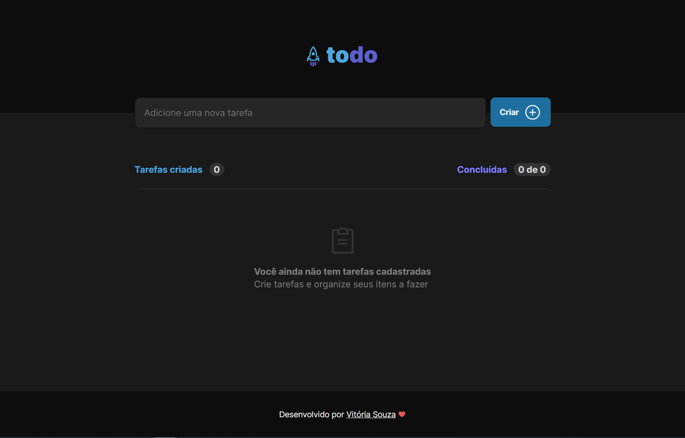
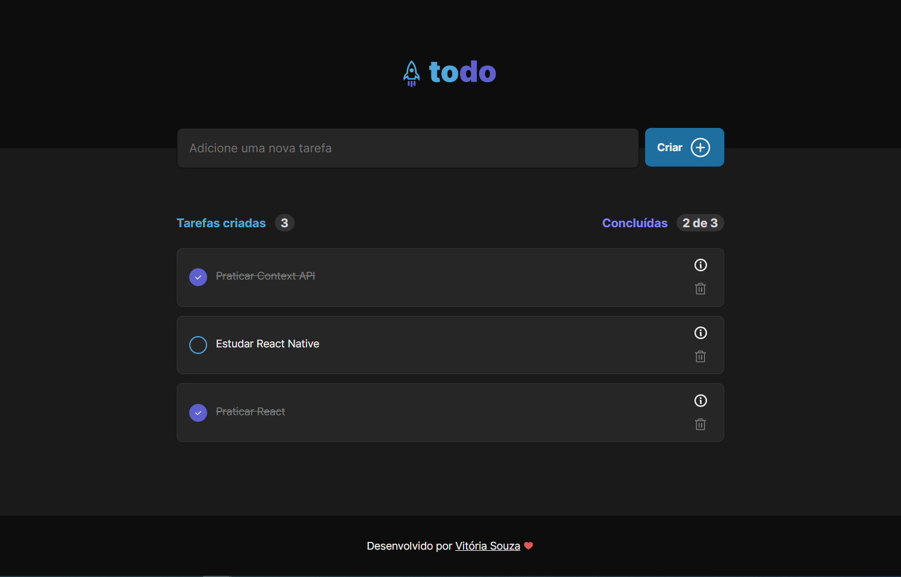
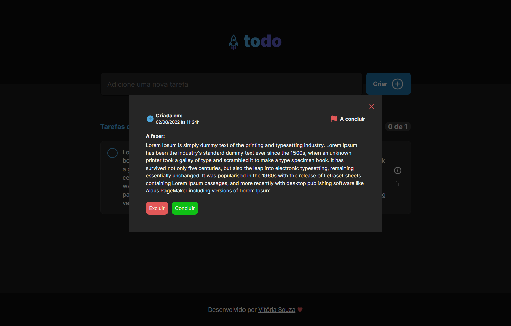

# **To-do List**

Esse projeto é uma plataforma para cadastrar, listar, concluir e excluir tarefas, ou seja, é uma lista de to-do

---

## 🚀 **Tecnologias**

Esse projeto foi desenvolvido com as seguintes tecnologias:

- [TypeScript](https://www.typescriptlang.org/)
- [React](https://reactjs.org)

---

## 💻 **Como executar**

- Clone o repositório
- Instale as dependências utilizando `yarn` ou `npm install`
- Rode o comando `yarn dev` ou `npm run dev`

---

## 📚 **Ferramentas, Bibliotecas e Pacotes**

- **Vite:** é uma ferramenta que converte o código para um formato que todos os browsers entendam, ou seja, permite que o navegador entenda o JS mais moderno.

- **Ícones:** [https://phosphoricons.com/](phosphor-react)

- **uuid:** gerar id automáticos/aleatórios

- **Headless UI:** (`@headlessui/react`) biblioteca que já contém elementos com **Acessibilidade**.

- **date-fns:** formatação de datas.

---

## ✨ **Deploy**

**Frontend:**: [Vercel](https://vercel.com/)
